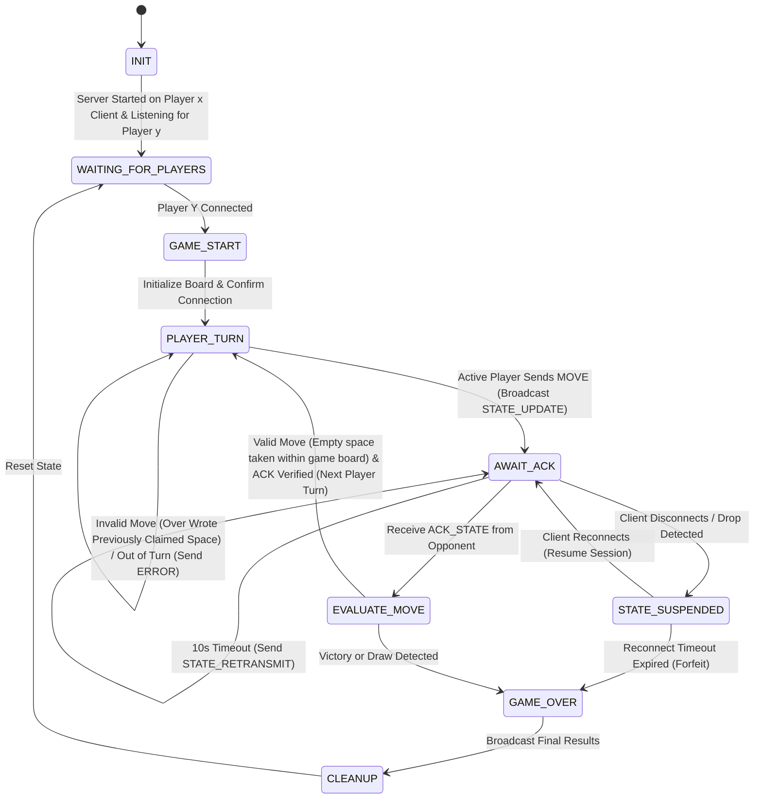

# Finite State Machine (FSM) Specification
## Tic-Tac-Toe Game Engine with Handshake Verification and Reconnection Recovery

## Mermaid FSM State Diagram

```mermaid
stateDiagram-v2
    [*] --> INIT
    
    INIT --> WAITING_FOR_PLAYERS : Server Started on Player x Client & Listening for Player y
    
    WAITING_FOR_PLAYERS --> GAME_START : Player Y Connected
    
    GAME_START --> PLAYER_TURN : Initialize Board & Confirm Connection
    
    PLAYER_TURN --> AWAIT_ACK : Active Player Sends MOVE (Broadcast STATE_UPDATE)
    PLAYER_TURN --> PLAYER_TURN : Invalid Move (Over Wrote Previously Claimed Space) / Out of Turn (Send ERROR)
    
    AWAIT_ACK --> EVALUATE_MOVE : Receive ACK_STATE from Opponent
    AWAIT_ACK --> AWAIT_ACK : 10s Timeout (Send STATE_RETRANSMIT)
    AWAIT_ACK --> STATE_SUSPENDED : Client Disconnects / Drop Detected
    
    STATE_SUSPENDED --> AWAIT_ACK : Client Reconnects (Resume Session)
    STATE_SUSPENDED --> GAME_OVER : Reconnect Timeout Expired (Forfeit)
    
    EVALUATE_MOVE --> PLAYER_TURN : Valid Move (Empty space taken within game board) & ACK Verified (Next Player Turn)
    EVALUATE_MOVE --> GAME_OVER : Victory or Draw Detected
    
    GAME_OVER --> CLEANUP : Broadcast Final Results
    
    CLEANUP --> WAITING_FOR_PLAYERS : Reset State
```
