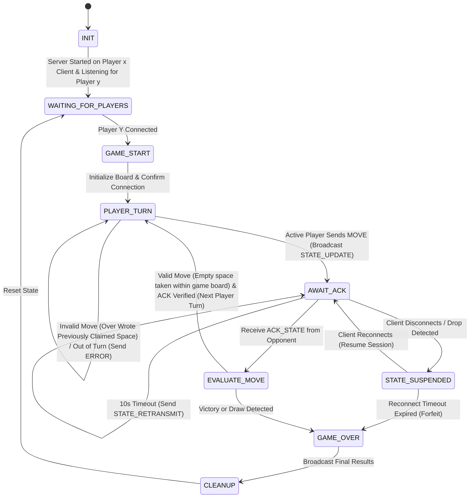

# Finite State Machine (FSM) Specification
## Tic-Tac-Toe Game Engine with Handshake Verification and Reconnection Recovery

## Mermaid FSM State Diagram

## State Definitions
| State Name | Description |
| :--- | :--- |
| `INIT` | Game host process initializes networking and socket bindings. |
| `WAITING_FOR_PLAYERS` | Player X host starts listening for Player Y to connect. |
| `GAME_START` | Both players connected; game board initialized and connection confirmed. |
| `PLAYER_TURN` | Active player's turn. Out-of-turn moves or overwriting taken spaces trigger error payloads. |
| `AWAIT_ACK` | Active player submitted move; host waiting for `ACK_STATE` from opponent. 10s timer active. |
| `EVALUATE_MOVE` | Move verified via `ACK_STATE`; evaluates valid empty space placements, win/draw conditions, or turn toggles. |
| `STATE_SUSPENDED` | Opponent connection dropped. Match paused awaiting session reconnect. |
| `GAME_OVER` | Game concluded via victory, draw, or forfeit timeout. |
| `CLEANUP` | Broadcasts final results and resets board state to accept new matches. |

## State Transition Logic
| Current State | Event / Trigger | Action Taken | Next State |
| :--- | :--- | :--- | :--- |
| `INIT` | Server starts listening | Bind socket on host (Player X) & listen for Player Y | `WAITING_FOR_PLAYERS` |
| `WAITING_FOR_PLAYERS` | Player Y connects | Confirm connection & establish match context | `GAME_START` |
| `GAME_START` | Connection confirmed | Initialize $3 \times 3$ grid, broadcast `GAME_START` | `PLAYER_TURN` |
| `PLAYER_TURN` | Active player sends `MOVE` | Broadcast `STATE_UPDATE(seq_id)` to opponent, start 10s timer | `AWAIT_ACK` |
| `PLAYER_TURN` | Overwrote claimed space / Out of turn | Return `ERROR` payload to sending client without changing board state | `PLAYER_TURN` |
| `AWAIT_ACK` | Receive `ACK_STATE` from opponent | Cancel 10s timer, pass control to move evaluator | `EVALUATE_MOVE` |
| `AWAIT_ACK` | 10s Timer Expires | Broadcast `STATE_RETRANSMIT` ping to opponent, restart 10s timer | `AWAIT_ACK` |
| `AWAIT_ACK` / `PLAYER_TURN` | Socket drop / Client disconnect | Pause match, preserve board state & active `sequence_id` | `STATE_SUSPENDED` |
| `STATE_SUSPENDED` | Opponent reconnects (`CONNECT`) | Re-bind socket, re-send pending `STATE_UPDATE` payload | `AWAIT_ACK` |
| `STATE_SUSPENDED` | Reconnect timeout expires | Declare active player winner by forfeit | `GAME_OVER` |
| `EVALUATE_MOVE` | Valid move (empty space taken) & no win/draw | Toggle active player turn | `PLAYER_TURN` |
| `EVALUATE_MOVE` | Victory or Draw detected | Set winner or draw status, generate `GAME_OVER` payload | `GAME_OVER` |
| `GAME_OVER` | Match concluded | Broadcast final results to connected clients | `CLEANUP` |
| `CLEANUP` | State reset complete | Reset board memory and return socket to listener loop | `WAITING_FOR_PLAYERS` |

## Disconnection & Error Handling Policies
### Invalid Moves & Out-of-Turn Enforcement
- **Overwriting Spaces**: If a player attempts to place a marker on an already claimed board cell, the host rejects the packet and dispatches an `ERROR` message containing code `INVALID_COORDINATES`. The turn indicator remains unchanged and the server loop continues running safely.
- **Out-of-Turn Play**: If a non-active player submits a `MOVE` payload while the other player is active, the engine responds with an `ERROR` message (`OUT_OF_TURN`) and maintains the current active turn state without crashing.

### Abrupt Disconnections & Session Recovery
- **EOF & Exception Detection**: Sockets returning `0 bytes` (`b""`) or raising low-level network exceptions (`ConnectionResetError`, `BrokenPipeError`) trigger an immediate transition to `STATE_SUSPENDED`.
- **Session Preservation**: Board grid configurations, active sequence IDs, and player roles are maintained in host memory.
- **Reconnection & Forfeit**: When the disconnected client issues a `CONNECT` message specifying their registered `player_id`, the host re-binds the active socket, re-issues the pending `STATE_UPDATE`, and returns directly to `AWAIT_ACK`. If reconnect fails before 300 seconds, the engine declares an opponent victory by forfeit.
- **Post-Game Reset**: Transitioning to `CLEANUP` flushes old match buffers and resets state variables, allowing subsequent game rounds without requiring a server process restart.
